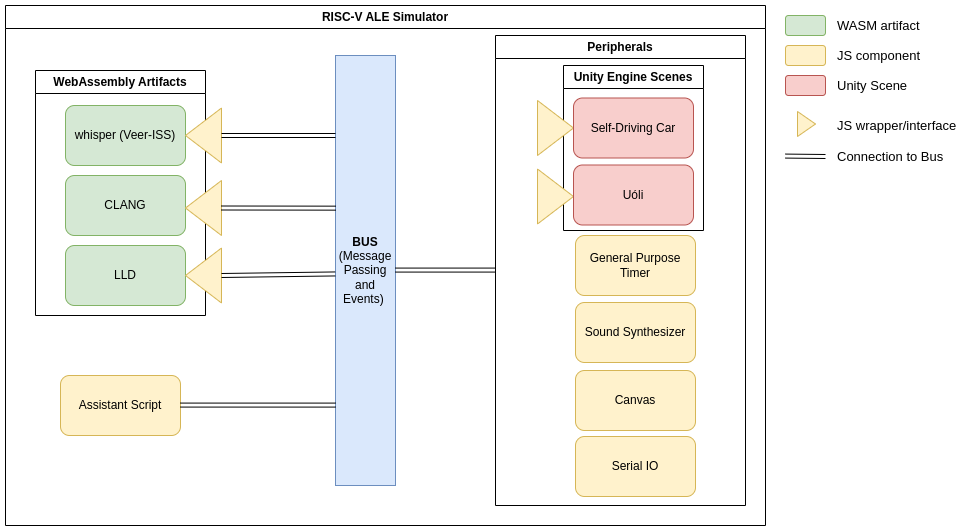

# Overview of the ALE Simulator

The ALE simulator is a web-based assembly simulator ecosystem, built on top of the 
[CHIPS Alliance VeeR-ISS](https://github.com/chipsalliance/VeeR-ISS) simulator.
ALE consists of a set of WebAssembly artifacts and JavaScript (JS) code, that enables the execution of VeeR-ISS in the browser with an interactive user interface (UI).
The UI provides functionalities that allow the user to load files, set syscalls and inputs to the program, and enable/disable external devices. In order to start the simulator, the user can either use the UI buttons (RUN, Debug, or Assistant->Run Tests) or use the terminal.
When using the buttons, the terminal will be popped open and display the commands that are being executed, these commands can be run in the terminal in a standalone manner, if necessary.

Figure 1.0.1 shows an overview of the components that make up the simulator.
Whisper, CLANG and LLD are third party softwares that were compiled to WebAssembly.
Whisper is the RISC-V simulator, CLANG and LLD are LLVM compilation tools made available to run in the browser, facilitating code generation.
They are exposed by using a JS wrapper that uses event handling and message passing to interact with the remaining components.
The Assistant Script is a customizable component that can dictate how to execute a given program with a set of inputs and expected outputs, this custom logic is encoded in a URL.
The peripherals are external devices that can be enabled, they are components with a fixed logic and are used to simulate the interaction with external devices.
Most of the peripherals are pure JS code, but the Self-Driving Car and Uóli are Unity simulations with a JS wrapper that provides an interface to the peripheral to handle events.
Assistant Scripts and Peripherals are explained in more detail in chapters 5 and 6 respectively.
Lastly, the bus represents the common stream of events/messages of the web application that all the components listen to and handle according to their logic.

Figure 1.0.1: RISC-V ALE Components.

