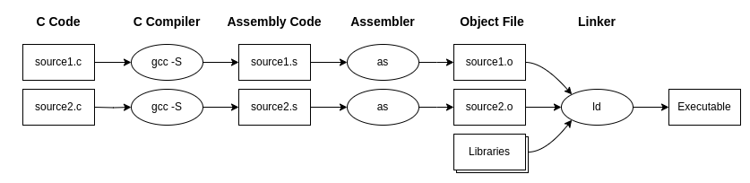

## Overview of the Compilation Process

The compilation process of a C language program involves three main stages:

1. **Compilation**: Each file with C code (with a `.c` extension) is translated into assembly language code (files with a `.s` extension).
2. **Assembly**: The assembler reads the assembly language files and produces an object code (with a `.o` extension on Linux).
   Note that complex software may consist of multiple source code files, resulting in various object files during the compilation process.
   Even though object files contain machine language code, they are not executable as the binary code is still separated into different object files and needs to be "linked" into a single file containing the entire code.
3. **Linking**: The linker reads multiple object files as input, links them together, and also links code from libraries.
   The result is the final executable, the program that can be run by the user.
   Figure 2.1 illustrates the compilation process of software with two source files: `source1.c` and `source2.c`.
   In this diagram, the `gcc -S` command invokes the compiler, the `as` command invokes the assembler, and finally, the `ld` command invokes the linker.

Figure 2.2.1: The compilation process of a program using GNU tools.

