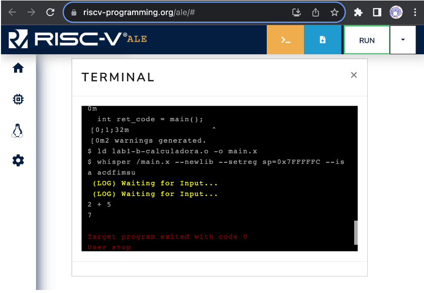
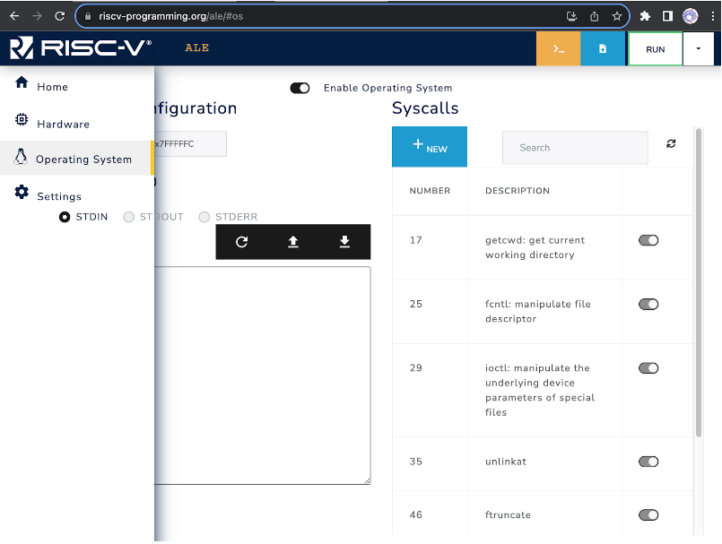

## Overview of the Loading and Execution of Programs

### Loading Files

The simulator has its own file system that enables storing multiple files.
To load files, you need to click on the file button  at the top right corner (left of RUN button), and select the files that you wish to load from your computer.

You can load executable files, source files or even data files to be accessed by your programs.

There is no directory structure, and existing files with the same name are automatically overwritten, in other words, if you load a file named `prog.x` more than once, just the last one will be kept.

### Run: Compilation, Assembly, Linking and Execution of Programs

Once you have loaded your files, you can start your program execution.
To do so, you must click on the RUN button (top right corner).

The simulator will identify the source files and, if necessary, perform the compiling, assembling and linking to get the executable.
Finally, the simulator will invoke the executable and show the program's output (if there is any).

**NOTE**: The simulator stops the program's execution when (i) the program invokes the system call (_syscall_) exit, or (ii) when the execution finds invalid instructions.
In the last case, the simulator may show error messages like "Error: Failed stop: 64 consecutive illegal instructions: 0".
This is expected in programs that do not call the exit _syscall_, as the processor doesn't know where the program ends and will continue to execute instructions consecutively, until it finds invalid instructions.

### C programs without LibC

Programs written in C are usually linked to the C standard library and with object files that contain support routines to the application's execution.
These routines, initialize the C library's data structures, organize the parameters to the main function (`_start`) and, after returning from the main function, invoke the operating system to signal the end of the application (function `exit`).

### `_start` function and `exit` _syscall_

Besides linking the code from multiple object files (`.o`), the linker must register the address of the entry function of the program on the header of the executable file so that the operating system's loader knows where to start the execution of the program once it starts.
By default, in C and C++, the program's entry point is defined by the function called **\_start**.
This is a short function that invokes the function **main** and after **main** returns, it invokes the **exit** _syscall_ to inform the operating system that the program has finished.

When generating the executable files, C and C++ compilers link an object file that has the implementation of this function.
However, the RISC-V compiler used here doesn't link to such file (nor LibC), this way, it is necessary to include an implementation of the function.

The following code shows possible implementations to the function **exit** and the function **\_start**.
In this example, the function **exit** consists of a sequence of instructions in assembly language that copies the value of function parameter (code) to the register `a0`, puts the value 93 on register `a7` and generates a software interrupt (`ecall` instruction).
The software interrupt redirects the execution flow to the operating system, which will use the value on register `a7` to determine which _syscall_ was requested and the value on register `a0` as a parameter to the call.

```c
void exit(int code)
{
  __asm__ __volatile__(
    "mv a0, %0           # return code\n"
    "li a7, 93           # syscall exit (93) \n"
    "ecall"
    :             // Output list
    :"r"(code)    // Input list
    : "a0", "a7"
  );
}

void _start()
{
  int ret_code = main();
  exit(ret_code);
}
```

The **\_start** function code simply calls the **main** function, which is implemented by the user, and, after **main**'s return, invokes the **exit** function passing the main return value as a parameter.

You can copy and paste these two functions on your C programs that will be executed on the ALE simulator.
Alternatively, you can put them in a file called `start.c` and compile/assemble/link the file with your program.

### `read` and `write` _syscalls_

In general, programs that execute in computer systems that have an operating system don't have direct access to the system's peripherals (_e.g._, monitor, keyboard, mouse, ...), in other words, that can't interact directly with these devices.
In this case, all interactions with these devices are done via system calls (_syscalls_).

The organization of the Linux operating system is strongly based on the concept of files.
In this context, each file is identified by a path and a name (_e.g._, /home/students/john/prog.c).
In addition to that, when a file is opened by a program, the operating system associates this file with a file descriptor and returns this file descriptor to the program.
The file descriptor is an integer that must be provided by the program every time it requests the operating system to perform an operation with the file (_e.g._, write or read of data).
In short, to write to (or read from) a file, the program must:

1. Invoke the operating system with the **open** _syscall_ to open the file.
   This syscall will open the file and return an integer that corresponds to the file descriptor of the opened file.
2. Invoke the **write** or **read** _syscall_ passing as argument the file descriptor of the file and a buffer to write or read data; and, finally
3. Invoke the operating system with the **close** _syscall_ to close the file.

There are three special file descriptors that are always available and don't have to be opened or closed: `STDIN`, `STDOUT` and `STDERR`.
The values of the file descriptors `STDIN`, `STDOUT` and `STDERR` are 0, 1 e 2, respectively.

These file descriptors correspond to the standard input, standard output and error output of the program.
When the program writes to standard output or error output, the operating system shows what was written on the terminal; where the program is being executed.
In case the program reads from standard input, the operating system (i) waits until the user types something in the standard input and press ENTER, and (ii) returns to the program what was typed in the terminal.

The following code shows the implementation of a function in C that contains code in RISC-V assembly language to invoke the _syscall_ **read**.
This function contains a set of RISC-V instructions that adjust the parameters and invoke the operating system to perform the **read** operation through the **read** _syscall_.

```c
/* read
 * Parameters:
 *  __fd:  file descriptor of the file to be read.
 *  __buf: buffer to store the data read.
 *  __n:   maximum amount of bytes to be read.
 * Return:
 *  Number of bytes read.
 */
int read(int __fd, const void *__buf, int __n)
{
    int ret_val;
  __asm__ __volatile__(
    "mv a0, %1           # file descriptor\n"
    "mv a1, %2           # buffer \n"
    "mv a2, %3           # size \n"
    "li a7, 63           # syscall read code (63) \n"
    "ecall               # invoke syscall \n"
    "mv %0, a0           # move return value to ret_val\n"
    : "=r"(ret_val)                   // Output list
    : "r"(__fd), "r"(__buf), "r"(__n) // Input list
    : "a0", "a1", "a2", "a7"
  );
  return ret_val;
}

```

As you don't have access to the C standard library, you can use the function above to perform read operations from the standard input.
To do so, just call the function **read** to the file descriptor of value 0.
To use it, you must allocate a buffer, that can be a global variable, like the example below.
Note that the global variable (`input_buffer`) is an array with 10 characters, a 10 byte array.
After reading the data, the **read** function writes the read bytes to the provided buffer and returns the amount of bytes read.
The last parameter of the **read** function indicates the maximum amount of bytes that must be read.
In case the amount of bytes that can be read is greater than this value, the **read** function just writes the maximum amount of bytes (10 in the example below) on the input buffer and returns.
The remaining bytes are stored in an internal buffer of the operating system and are returned when the **read** function is called again.

```c
/* Buffer to store the data read */
char input_buffer[10];

int main()
{
  /* fd = 0 : reads from standard input (STDIN) */
  int n = read(0, (void*) input_buffer, 10);
  /* … */
  return 0;
}

```

The following code shows a possible C implementation of the function **write**.
This C function contains a code in RISC-V assembly language to invoke the system call (_syscall_) **write**.
It invokes the operating system to **write** **\_\_n** bytes from the buffer \_\_buf on the file (or device) indicated by the file descriptor, parameter \_\_fd.
When \_\_fd = 1, this function writes to the standard output (STDOUT).

```c
/* write
 * Parameters:
 *  __fd:  files descriptor where that will be written.
 *  __buf: buffer with data to be written.
 *  __n:   amount of bytes to be written.
 * Return:
 *  Number of bytes effectively written.
 */
void write(int __fd, const void *__buf, int __n)
{
  __asm__ __volatile__(
    "mv a0, %0           # file descriptor\n"
    "mv a1, %1           # buffer \n"
    "mv a2, %2           # size \n"
    "li a7, 64           # syscall write (64) \n"
    "ecall"
    :   // Output list
    :"r"(__fd), "r"(__buf), "r"(__n)    // Input list
    : "a0", "a1", "a2", "a7"
  );
}

```

Again, as you don't have access to the C standard library, you can use the function above to write to the standard output of the program, in other words, the terminal where your program was executed.
To do so, just call the function **write** to the file descriptor 1.
The code below shows an example where the **write** function is called to show a string on the output terminal.

```c
/* Allocates a global string with 5 bytes.
 *   Note: the break line character, \n is encoded
 *       with a single byte */
char my_string[] = "1969\n";

int main()
{
  /* Prints the first 5 characters from the string on
   * the standard output, in other words, 1, 9, 6, 9 and break line. */
  write(1, my_string, 5);

  return 0;
}

```

The ALE simulator expects a break line character (`\n`) to print the content written to the standard output on the terminal.
This way, you must add a break line character at the end of your buffer or call the function write again with a string that has the break line character.
The example above shows a program that prints a string with 5 characters ending with a break line.

### Complete example

The following program combines all the parts discussed above and implements a program that reads a string from the standard input, makes specific modifications to the string, and writes the modified string to the standard output.

```c
int read(int __fd, const void *__buf, int __n){
    int ret_val;
  __asm__ __volatile__(
    "mv a0, %1           # file descriptor\n"
    "mv a1, %2           # buffer \n"
    "mv a2, %3           # size \n"
    "li a7, 63           # syscall write code (63) \n"
    "ecall               # invoke syscall \n"
    "mv %0, a0           # move return value to ret_val\n"
    : "=r"(ret_val)  // Output list
    : "r"(__fd), "r"(__buf), "r"(__n)    // Input list
    : "a0", "a1", "a2", "a7"
  );
  return ret_val;
}

void write(int __fd, const void *__buf, int __n)
{
  __asm__ __volatile__(
    "mv a0, %0           # file descriptor\n"
    "mv a1, %1           # buffer \n"
    "mv a2, %2           # size \n"
    "li a7, 64           # syscall write (64) \n"
    "ecall"
    :   // Output list
    :"r"(__fd), "r"(__buf), "r"(__n)    // Input list
    : "a0", "a1", "a2", "a7"
  );
}

void exit(int code)
{
  __asm__ __volatile__(
    "mv a0, %0           # return code\n"
    "li a7, 93           # syscall exit (64) \n"
    "ecall"
    :   // Output list
    :"r"(code)    // Input list
    : "a0", "a7"
  );
}

void _start()
{
  int ret_code = main();
  exit(ret_code);
}

#define STDIN_FD  0
#define STDOUT_FD 1

/* Buffer to store the data read */
char input_buffer[10];


int main()
{
  /* Reads a string from standard input */
  int n = read(STDIN_FD, (void*) buffer, 10);

  /* Modifies the string */

  /* Replaces the first character with the letter M */
  buffer[0]   = 'M';

  /* Replaces the last character (n-1) with an exclamation mark and
   * Adds a newline character to the buffer immediately after the string
   * NOTE: In the ALE simulator, if the input is typed in the terminal
   * and followed by pressing Enter, the last character will be a '\n'.
   */
  buffer[n-1]   = '!';
  buffer[n]     = '\n';

  /* Prints the read string and the two added characters
   * in standard output. */
  write(STDOUT_FD, (void*) buffer, n+2);

  return 0;
}
```

During its execution, the program invokes the operating system to read a string from the standard input, _i.e._, from the terminal displayed by the simulator.
The operating system, in turn, waits until the user types something in the terminal and presses ENTER.
It then stores the typed string in the buffer provided by the program and returns the number of bytes read.
Figure 3.1.1 shows the simulator's terminal.
In this case, to enter data into the standard input, simply click on the terminal window, type the text, and press ENTER.

<div style="text-align:center">



<span class="caption">Figure 3.1.1: Simulator terminal.</span>

</div>

### Enabling System Calls in ALE

The ALE simulator is configurable and allows users to run applications with or without system call (_syscall_) support.
To enable or disable _syscalls_, or to choose which _syscalls_ are available, you can click on the Operating System menu (penguin icon) and adjust the options, as illustrated in Figure 3.1.2.

<div style="text-align:center">



<span class="caption">Figure 3.1.2: Adjusting System Call Options in ALE.</span>

</div>
