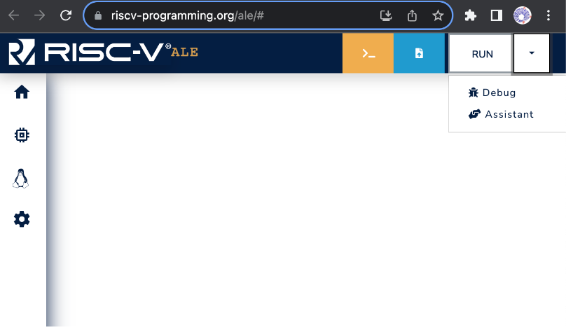
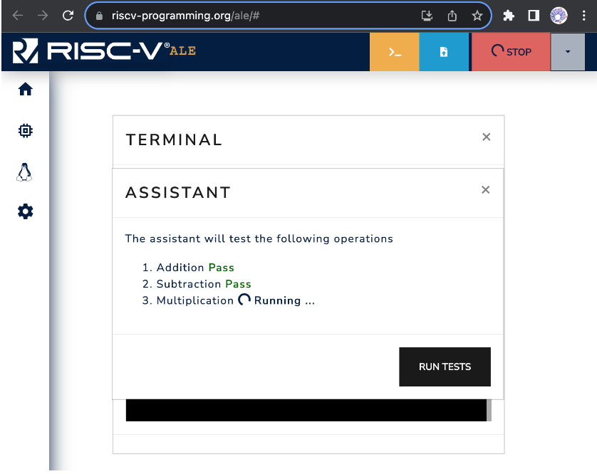
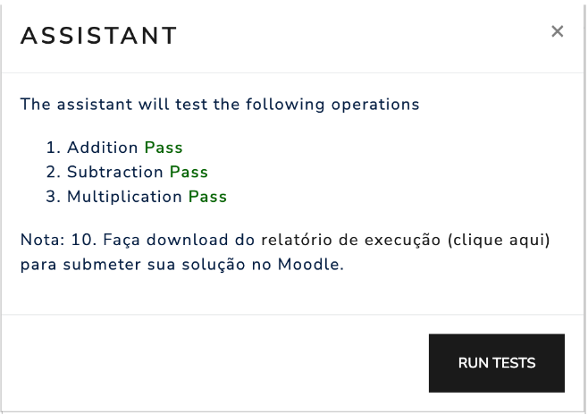

## Execution with the Assistant

The ALE simulator supports the use of execution assistants that automatically run one or more tests with the loaded code and produce a report with information about the submitted code and the results of the tests.

### Overview of the Execution Assistant

The assistant is encoded in the URL that points to the simulator.
This link, for example, contains the address of the simulator and the code for an assistant that is loaded when the simulator is opened.
You can click the link and inspect the menu that appears after clicking the arrow next to the RUN button.
Figure 3.2.1 illustrates accessing the debugging assistant.

Figure 3.2.1: Accessing the Assistant in the ALE Simulator.

When you click on the Assistant button, the simulator will open a window with information about the debugging assistant.
The information provided depends on the specific assistant.
Figure 3.2.2 shows the assistant loaded from the link above.
Note that it includes the RUN TESTS button, which is used to start the tests.

Figure 3.2.2: Example of a window with assistant information. In this case, the assistant contains three tests: 1. Addition, 2. Subtraction and 3. Multiplication.

### Running a program with the execution assistant

To test your program with the debugging assistant, simply open the simulator with a link that includes an assistant (<a href="https://riscv-programming.org/ale/#select_url_content=TjRJZ3RnaGdsZ2RnK2dCd2djd0tZZ0Z3aEFHaEJBWndLZ0lCY0laUzRDQmpBSnlnVk14QUhwV0FDQVVRQThJd0VBRzFRY0E5Z0RNT2hZbVFxa090Qmt3NEFkR0ZBR2k2ODRBRlVBa25BQVNxUVFsUjBjSEFJSkVTNVNuQURLOVJxUUMrSGNYVkZoVklBRHBXTUZFQUV3QlhZUUpXYVhzNUFJQXJBaFVRTlEwRUxSMEFHVkVhQ0VFQUpWUU03VTl2WDM4Z2tJaW8xaHBSR0JoVUdsSW9Cc1Rra0FCdU5UVWFRV2tPQUdGOG1raUlVaTBPVkI1U1ZCaFFnaHM3V1VjWEpWSmdOUTRPZXBneU9uQ1dyUUFLQUVvdG1CMmRnbkR6T25PZXErdlNBQXNTQVBDb0RnQmVEaWFBTzRjQXpHVXozRTRwQUFxcnhFc1ZXOGdCVUVFZ2c0Y3pJcUpoWGxFeU5FaUpneURFOXdtYlgyS1RPVDJ1SEdFOGpveFV5djMrcUNCT1R5aFRwMmtlMnhlN3dJQVQyVFJhSk41Q0hDQkZlSjFwSlZJNU42engyN0Nrb1ZDdTFGa3o4YVBrNGltYjFoU3FnclFhWEoyYncrWHdDRUNWY0ExRUpBMWoxQnBnS1NzaEFBbmpBYUY1d3U2SFJ4emh4THBTZG50MFJBR1NiZVhRS0tGWUtRVGdBR0hBQVRobGN1dXdma0FDTXd6eUFwR0ZqSDQwbUFMUVFGT0JqRWZBaW9LaXdmWE9TRUFFWDBBRGtUZ0FEQUFrd0FnbmdBMUJ3dXhuM0NwZWlvNDIyeTRHb09JVGdCQ0U0UUFIUWVUaDNOZTZnYWNhVEI1blhjQjhzVjNsbXdTaVpBMjV1aUx4SWtSVjRRdFZDaE1rVWcrMDBqaE9oWGNUNUt2UHluRDFNN0l1eTZIZ0VCRENNVUp3QUt4eGpCazZVc0cyS29BRUo1bnF1WkNoS0k0U2tBQVF1RTRqaUJZY0ZwZzA2SzByY2dqeUg4YUdrQmhXRzRmaEZnQktRREJnSnlBRWdjZXA3dHBDcUJrQmdBN2RuMkFsRHR3UERtUGVvVDhWMm9iOWlKUlRrYVFVbkFHUmtRZUJPdjdjcFdrd0lCdVlCYnFjUkU3Tk9FcThhcHZ4LUoyM1ljTEo3Z1R2dTVhdnUrVnpNZUVxQWFUczdpbUZXOW1CbzVINWVOK2JsR3RjLTUtZ0VHYXdLRUp6aHJ1VHpCYXVab1dxRVZxOGJHS1JPT0VHYk1SQWdxR3JnVWdFRzZIcmlGNnVWWEg2UG53U1I4aWhsUk9aNXRHbENGc203bkVmc21iWmg4RFVGZ21wYXRjYU9aVmpXNmhVRTRqWXR1MjBtZUVXd25EcU80NkdkY3huemtCK29nWWM4REVIcEF6YnVjZTdCZVdDVlFNaFhFcEJlVjdDQW9wak5ITWo0Z0l0bEorWitnWDlSd29VSHF0SzZEZUJDQlFUQmNZUGJzSkdJU2RxR0RUUm1FNFhoQkYwSUQ2WWNDcEZHZGJ5NkdRLVJNTk1TeGJFSGh4eDBvZHhxVktUMkhBellPbmk4T0p0MUV5VEhCeWFaRkZLWWphbUE5Um9nNlZ0K2s3cTl4bE0rWkhDV2FHTTFEblpCMitkV1Rtb29jUVhzUjVYbW9KVll0dnY1WDZDRCtvc2VhTDdqaFpGMFU4ckZzcVVrZDVxV3RhS1FBTEtxWXdnaFFIa0RwT2dWUldldDZKSyttYy1ycTBEN1ZTTWp1WlJqMU9BQU14dzlWdE0rOTFUVUprSHIxb2RXY0MxcU40MnRnTG5nQUZTelNPanBqdXBIdkxRdVM1cmF1RzI2WnplMFhCN2hzNXB4WjVuWmU0alhsZGQ2M1UrNWZYRTlBV3E5TE9QdmVXbjBnV0JxQVFkQnNHdlFod2lnN3JXbTBWRERHd3lQSWU4M1ZrOW85RGpITVJvMk1Ia2IrTnRqeGZFQ2NUYWRrNkpsTVB0VGFkMHdwalAwOHowZmcyenhjN1FaM016Z3ZGblNSdzUrMldYTXVLeExMbWR3ZVR5SGNGWU9YRnNyRjZIdHU0aFcxZ3NDZUJCOWFPbFRFYk91TUI4aHdBWGh3T0F2d0FCODd0MktTa3lMbWRrcEFBRGFLUU5Ub092cDBBQXVqN00wRkNtWUVGYXRTZjRvaHlBTWpqSzFMVWRCZlFzTytIOFRoSEJ2Z0FCNWNaTVZTcFFoU3ZKaEQ0amVGMElSdlpleHV4QWF3OWh2WkY1SG1PZ3dxaEpDb0RVSlRpY0FBakhHVmdVZE5haXdJZG9JaFVveUVnQlFXZzVBa1pRaW9CU0xRdjRNQTJFUURpdXhGaEdZVHhaaitKWTBnQVEwQk5FakhNU2hVb042UFRBVmNOc0Y1eUJLUThlUUxXSEFBQmlFQUFEbm9ZTUlBaGdDZUMwSEFNSWNHRWFHVjR0SnhBLUM3SGlYSkFSZEFGQ3lIeVdrRXhVQUFIa013SkJ1dlVySUp3LUdpQXpHY1R3dVQ4bWlBdEQ4RklBd015R0l6SkV6SUtSc0cwaDJnQVo0WUplWngwd2VETkhDSmtnQXg1ZUU0LVFvQUFFZFhKU0JPVkFNNHdpWWk0S1FKR0JRbVV3RFZnc1BjME1CQnNUYkwyYXdqZ1p0UkJoREhtMllLLTR1UkF1ZUFiQkdmc21wZ0ZnRllTQVBCbEhCVGJtYkNZcndBamlCUEtjSkZieGZZTEY4SDZOT0p4WVUweWhUQU4yLVppV1RoQlNDd0V3eFJnbDNKTGdFQWV3NjdJRXdLQU5tRG9DQ3NzWlEwWmxjY0NBUUdzSmdmK2VBbVZRR1FIeWlBUXdoVlN4RlR5c1ZFcUd6U3RjckttQXZLU0FRRFNVcTFBS3ExWDh2MEZxblY4cjFWbXdOZHkxVlJyK1ZPRk5hSzhWNnJkQ212bUJBUHhxQnFDaURnRFFHRU5BQURXR1pSQThGTlc4Nmc1QnZXSUZFREdDd2NBQUJ1K1JYSXNEakR3QUE3R2s1TnlhcFY0QmpIQWJ3cUFqbm9Jb0dnRmdBQW1TQ0lCM0I0RUtyUWZJcXRXV2xwQU00eU5OdGVMVnZjTzRJQUE=" target="_blank">such as this one</a>), load your program into the simulator (see Chapter 3.1), and click the RUN TESTS button in the assistant's window.
Figure 3.2.3 shows an example where the assistant is running tests with the loaded program.
In this case, the program produced the correct results for tests 1 (Addition) and 2 (Subtraction) and is currently being executed with test 3.

Figure 3.2.3:Example of test execution with the assistant.

Some assistants provide an option to download a report with the test results at the end of the testing process.
Figure 3.2.4 shows an example where, after the tests are completed, the assistant displays the score and provides a link to retrieve the report.

Figure 3.2.4: Example of test execution.

