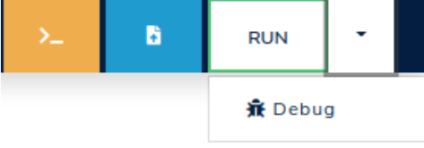
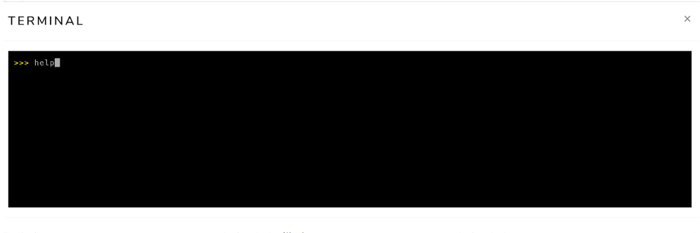
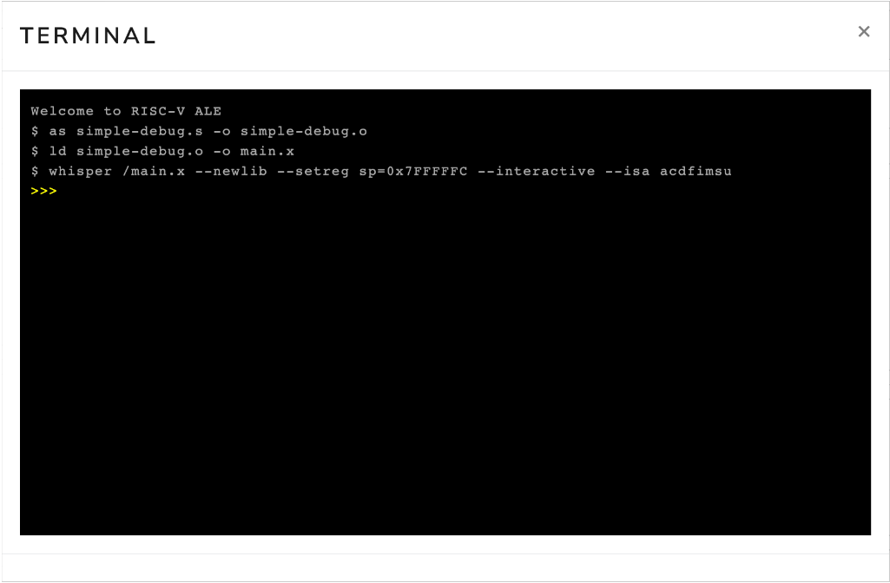
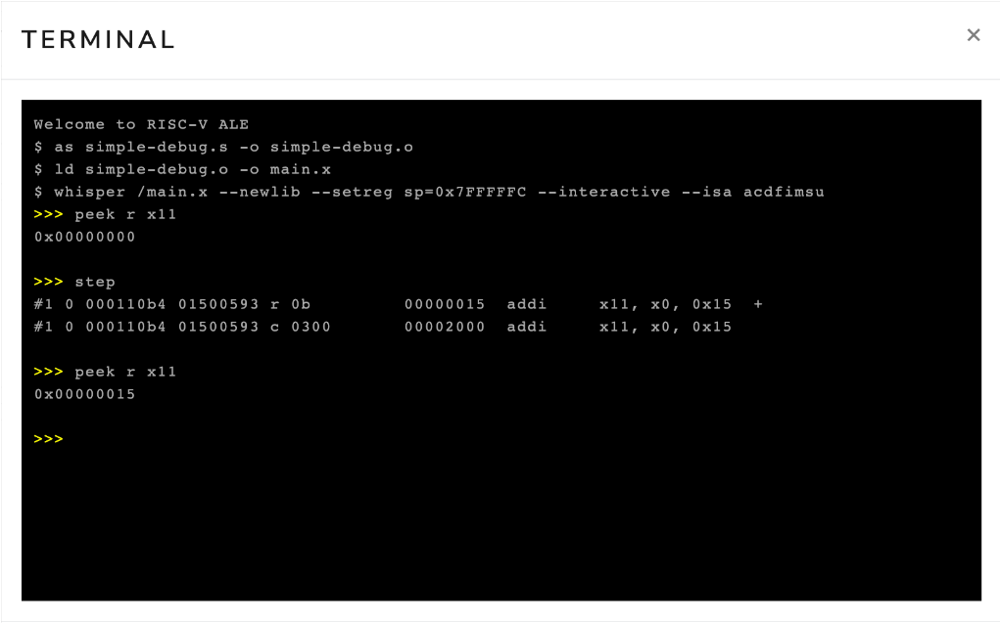
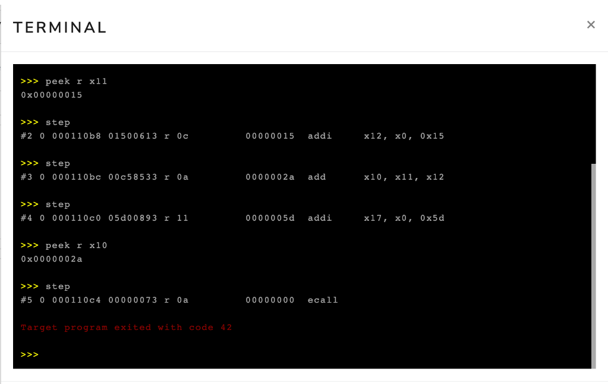
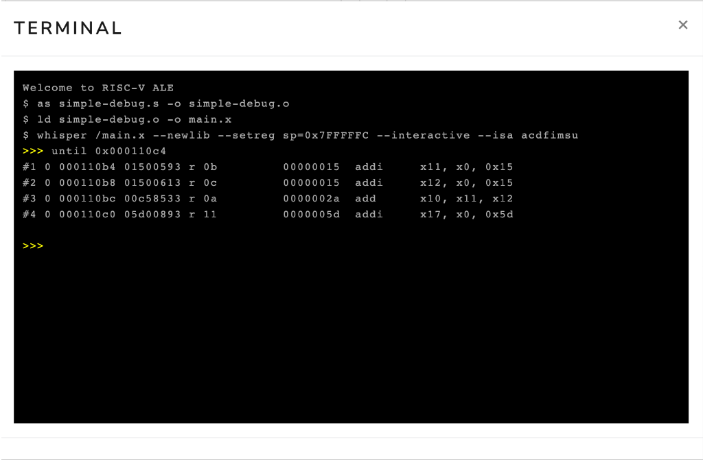
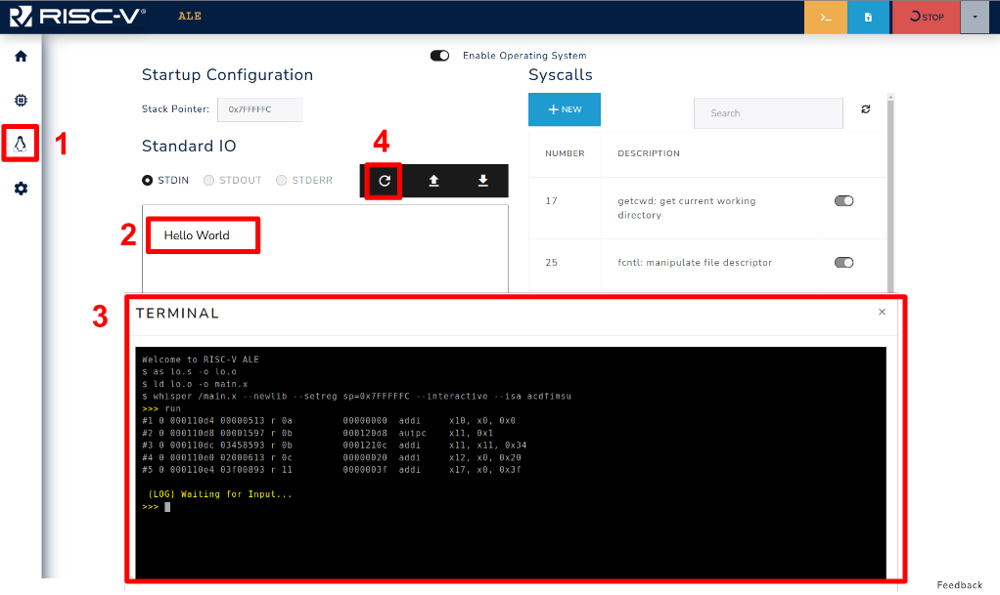
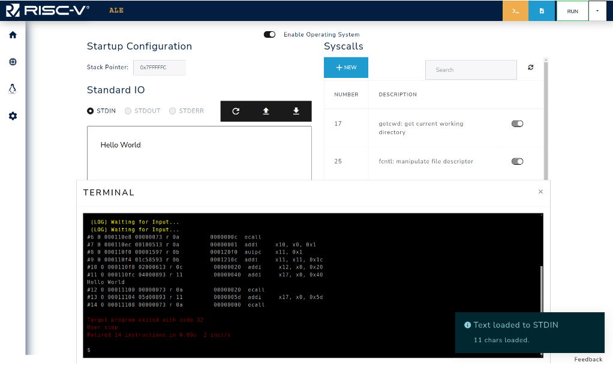

## Debugging Code with ALE

The ALE simulator features an interactive interface that allows users to control program execution and inspect the values of registers and memory.
This interface is very similar to the GDB debugger's interface, enabling users to debug their code's execution.

### Overview of the interactive interface

To enable the interactive execution interface, simply click the arrow next to the RUN button and select the "Debug" option, as illustrated in Figure 3.3.1.

<div style="text-align:center">



<span class="caption">Figure 3.3.1: Select the "Debug" option.</span>

</div>

Once you clicked on the Debug option, the simulator will open an interactive terminal where you can enter commands to control execution and/or inspect the state of the memory and registers of the RISC-V processor.
Figure 3.3.2 shows an interactive terminal.

<div style="text-align:center">



<span class="caption">Figure 3.3.2: Interactive terminal in the ALE simulator.</span>

</div>

### Debugging commands

To see the complete list of available commands in debug mode, you can run the `help` command in the interactive terminal.
Simply type `help` in the interactive terminal and press ENTER.
A portion of the command list displayed by the `help` command is shown below.

```bash
run
  Run till interrupted.
until <address>
  Run until address or interrupted.
step [<n>]
  Execute n instructions (1 if n is missing).
peek <res> <addr>
  Print value of resource res (one of r, f, c, m) and address addr.
  For memory (m) up to 2 addresses may be provided to define a range
  of memory locations to be printed.
  examples: peek r x1   peek c mtval   peek m 0x4096
peek pc
  Print value of the program counter.
peek all
  Print value of all non-memory resources
poke res addr value
  Set value of resource res (one of r, c or m) and address addr
  Examples: poke r x1 0xff  poke c 0x4096 0xabcd
symbols
  List all the symbols in the loaded ELF file(s).
quit
  Terminate the simulator
```

The following table summarizes the main commands available in the interactive interface of the ALE simulator:

| Command                     | Description                                                                                                                                                                                                                            |
| :-------------------------- | :------------------------------------------------------------------------------------------------------------------------------------------------------------------------------------------------------------------------------------- |
| `symbols`                   | Shows the address of symbols (_e.g._, `_start`, `loop`, `end`, `result`) of the program. The address is displayed in hexadecimal format (_e.g._, `0x11180`).                                                                           |
| `until <address>`           | Executes instructions of the program until a certain address. The address must be provided in hexadecimal format (_e.g._, `0x11180`).                                                                                                  |
| `step [n=1]`                | Executes the next n instructions                                                                                                                                                                                                       |
| `peek r <register>`         | Displays the value stored in register <register> (_e.g._, `peek r x1` or `peek r mtval`). The value is shown in hexadecimal format. The command `peek r all` shows the value of all registers.                                         |
| `peek m <address>`          | Displays the value stored in the memory word at address `<address>`. The value is shown in hexadecimal format.                                                                                                                         |
|                             |
| `poke r <register> <value>` | Modifies the content of register `<register>` with the value `<value>`. For example, the command `poke r x1 0xff` stores the value `0xff` in register `x1`.                                                                            |
| `poke m <address> <value>`  | Modifies the content of the memory location associated with address `<address>` with the value `<value>`. For example, the command `poke m 0x800 0xfe` writes the value `0xfe` to the memory location associated with address `0x800`. |
| `run`                       | Executes the program until it terminates through a system call `exit` or encounters invalid instructions.                                                                                                                              |

### Interactive execution example

In this section, we will show an example of interactive execution with the ALE simulator.
For this, we will use the program `simple-debug.s`, as follows:

```riscvasm
.globl _start

_start:
  li x11, 21          # loads the value 21 into register x11
  li x12, 21          # loads the value 21 into register x12
  add x10, x11, x12   # adds the contents of registers x11 and x12 and
                      # stores the result in register x10
  li a7, 93           # loads the value 93 into register a7
  ecall               # generates a software interrupt
```

This program loads the value 21 into registers `x11` and `x12`, performs the addition of these values, and stores the result in register `x10`.
Finally, it invokes the `exit` _syscall_.
To do this, the program loads the value 93 into register `a7` and generates a software interrupt by executing the `ecall` instruction.

The first step is to load the `simple-debug.s` file into the simulator.
To do this, simply use the file upload button (blue), as discussed in Chapter 3.1.
Next, you should open the interactive execution terminal by clicking on the debug button, as presented in Chapter 3.3.1.
Once you open the interactive execution terminal, you should see messages indicating that the `simple-debug.s` program has been assembled and its execution has begun in interactive mode, as illustrated in Figure 3.3.3.

<div style="text-align:center">



<span class="caption">Figure 3.3.3: Interactive terminal opened right after loading the file `simple-debug.s`.</span>

</div>

Now, simply click on the terminal and type commands to interact with the simulator.
To illustrate this procedure, we will execute the following sequence of commands:

```
peek r x11
step
peek r x11
```

Figure 3.3.4 shows the interactive terminal after executing the commands `peek r x11`, `step`, and `peek r x11`.
The first command shows that the content of register `x11` is zero (0x00000000).
The second command advances the execution of the program by one instruction.
Note that the simulator displays the instruction `addi x11, x0, 0x15`, which adds the content of register `x0` (which is always zero[^1]) to the constant `0x15` (_i.e._, 21 in decimal), and stores the result in register `x11`.
In our assembly language program, we had the instruction `li x11, 21` (load immediate), which loads the value 21 into register `x11`.
The load immediate instruction is a pseudo-instruction (it does not exist in the architecture) and is usually transformed by the assembler into an `addi` instruction.
Finally, the third command inspects the content of register `x11`.
Note that this time it contains the value 21 (0x00000015).

Also note that, the interactive terminal outputs some informations regarding the instruction that was executed in the format:

<div style="text-align:center">
#{Inst Num} 0 {Mem Addr} {Inst Code} {Inst Type} {Val} {Mnemonic}
</div>

- **Inst Num**: number of the machine instruction that was executed
- **Mem Addr**: memory address of the instruction that was executed.
- **Inst Code**: code of the instruction that was executed.
- **Inst Type**: can be either `r` if the instruction uses only register or `m` if there is a memory access (store or load).
- **Val**: value stored in the `rd` register for instructions of type `r` or stored in the memory position accessed for type `m` instructions.
- **Mnemonic**: assembly mnemonic of the executed instruction.

The second occurrence of the instruction #1 can be ignored.

<div style="text-align:center">



<span class="caption">Figure 3.3.4: Interactive terminal after executing the commands `peek r x11`, `step` and `peek r x11`.</span>

</div>

Now, we will execute the following sequence of commands to advance our program to the end, that is, until we invoke the `exit` _syscall_.

```
step
step
step
peek r x10
step
```

The first three `step` commands advance the execution to the `ecall` instruction, executing the instructions `li x12, 21`, `add x10, x11, x12`, and `li a7, 93`.
The next command displays the content of register `x10`.
Finally, the last command advances the execution, causing the simulator to execute the `ecall` instruction.
Figure 3.3.5 shows the interactive terminal after executing these commands.
Notice that, again, the `li` instructions from the source program were encoded as `addi` instructions.
Also, the value of register `x10` has been changed to `0x2a` (42 in decimal).
Finally, note that the program ended with code 42.
This occurred because we passed the value 42[^2] as a parameter to the `exit` _syscall_.

<div style="text-align:center">



<span class="caption">Figure 3.3.5: Interactive terminal after executing the commands `step`, `step`, `step`, `peek r x10`, `step`.</span>

</div>

In the example above, we used the `step` command to advance the program execution instruction by instruction.
However, in many situations, it is useful to advance the simulation automatically to a certain point in the program.
To do this, you can use the `until` command.
This command takes as a parameter the address of the instruction where you want to advance to.

In Figure 3.3.5, we see that the `ecall` instruction is at address `0x000110c4`.
Therefore, if we wanted to advance execution to this point, we could execute the command `until 0x000110c4`.
Figure 3.3.6 shows the interactive terminal after executing the command `until 0x000110c4`.
Note that the simulator displayed the execution of the first four instructions of the program.

<div style="text-align:center">



<span class="caption">Figure 3.3.6: Interactive terminal after executing the command `until 0x000110c4`.</span>

</div>

#### Identifying the address associated with instructions

As seen above, you can use the address of an instruction to advance execution to the desired instruction.
To do this, you need the address of the instruction.
The most direct way to obtain the address of an instruction is by using the disassembler.
To do this, you need to disassemble the final executable file.
Chapter 2.6 discusses how to use the disassembler.

Another way to identify the address of an instruction is from the label that precedes it in the code.
In our example, the address of the first instruction corresponds to the address of the label `_start`.
To identify the addresses associated with the labels in your program, simply execute the `symbols` command.

If the instruction of interest does not have a preceding label, you can add a new label (with a name different from other labels in the program).
This label will not affect code generation, _i.e_, the set of emitted instructions will remain the same.
The following code snippet shows the `simple-debug-2.s` program modified with a label to facilitate the identification of the address of the instruction `li a7, 93`.
When you load this program into the simulator and execute the symbols command in the interactive terminal, you will see the addresses associated with the symbols `_start` and `before_exit`.

```riscvasm
.globl _start
_start:
  li x11, 21          # loads the value 21 into register x11
  li x12, 21          # loads the value 21 into register x12
  add x10, x11, x12   # adds the contents of registers x11 and x12 and 
                      # stores the result in register x10
before_exit:
  li a7, 93           # loads the value 93 into register a7
  ecall               # generates a software interrupt

```

### Terminal IO in Debug Mode
When in debug mode, there are two ways in which you can provide an input to your program in case a `read` _syscall_ is called.
The first one is to use the **Standard IO** textbox to load the input, and the second is to use the `write-stdin` command followed by the input string on the terminal input.
These two ways are demonstrated with images below.

<div style="text-align:center">



<span class="caption">Figure 3.3.7: Loading input using the OS **Standard IO**.</span>

</div>
<div style="text-align:center">



<span class="caption">Figure 3.3.8: Simulator after loading the input.</span>

</div>

Figure 3.3.7 shows how to use the OS to load the input that will be read by the program.
First go to the OS tab (1) and write your input on the textbox (2), then run your code in debug mode until the point where the input is expected (3).
Finally, load the input by clicking on the button (4).
Figure 3.3.8 presents the terminal after loading the input, as the code just reads an input and writes it to STDOUT you can see that the input (_Hello World_) is printed on the screen and the program exits.
The input can also be loaded prior to the program execution (step 4 before 3).

<div style="text-align:center">


<span class="caption">Figure 3.3.9: Blocked program waiting for input in Debug Mode.</span>

</div>

<div style="text-align:center">


<span class="caption">Figure 3.3.10: Command `write-stdin` is used to set input in debug mode.</span>

</div>

The other way that can be used to provide input to your program is via the `write-stdin` command.
When the program reaches a point where the `read` _syscall_ is invoked, it blocks waiting for the input, and the user can use the terminal as shown in Figure 3.3.9.
Figure 3.3.10 shows the `write-stdin` followed by the input string being used, and after the command the program continues its execution using the provided input.

[^1]: In RISC-V, register `x0` always holds the fixed value of zero.
Even if an instruction tries to write something to this register, the value zero will be preserved in the register.

[^2]: The `exit` _syscall_ expects a parameter, which is the exit code, in register `a0` (which is an alias for register `x10`).

[^3]: Although the object file contains the same instructions as the final executable file, the address of the instructions is usually modified by the linking process.
Therefore, you should use the final executable file when you want to identify the addresses of the instructions.
