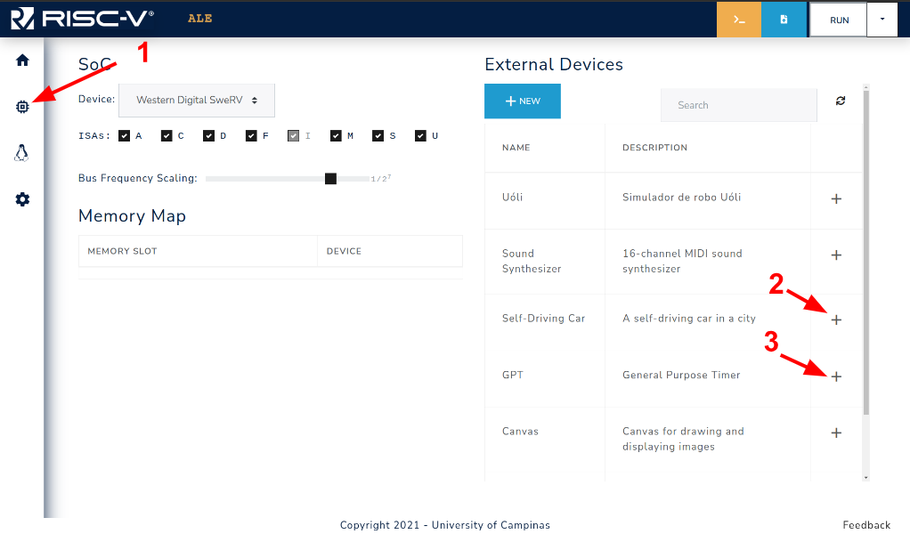
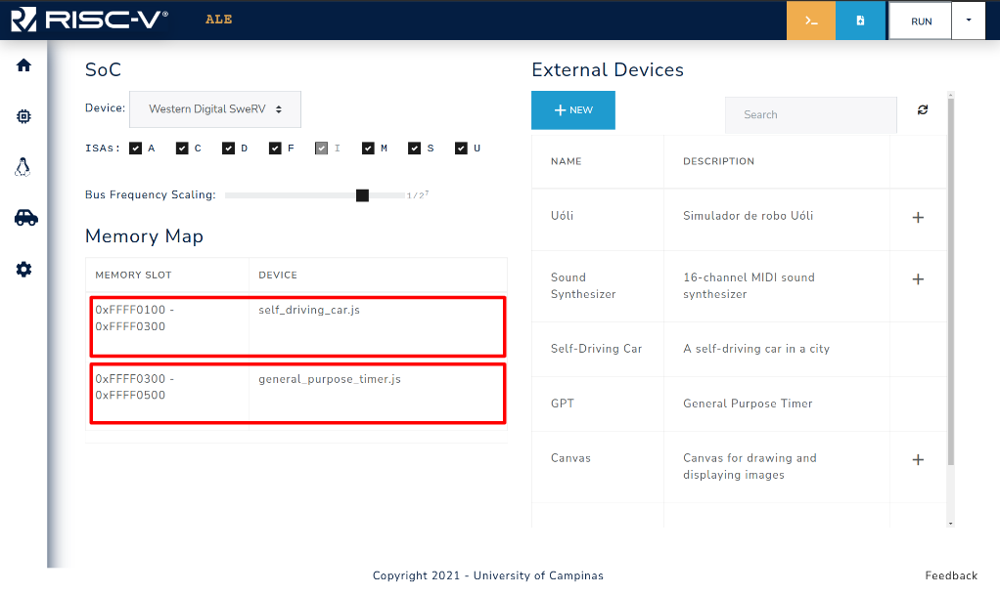

## Enabling and Interacting with Peripherals

The ALE simulator features a set of peripherals that can be enabled to perform a set of tasks, such as controlling a car in a 3D environment, playing a song with a MIDI player, or displaying an image on a canvas.

### Overview of Peripherals and how they are connected to the system

Peripherals are input/output devices that are connected to the computer using a bus.
The interaction between the CPU and such devices can be performed either by port-mapped IO or Memory-mapped IO.
The former uses special instructions to access the peripheral's register and internal memory, while the latter uses some memory regions in order to perform I/O operations with the peripheral device.
More information about this topic can be found in Chapter 8 of the book [An Introduction to Assembly Programming with RISC-V](https://riscv-programming.org/book.html).

<div style="text-align:center">



<span class="caption">Figure 3.4.1: Steps to enable external devices.</span>

</div>

In the ALE simulator, the peripherals are accessed with MMIO, and the region of the memory 
that is reserved to each peripheral is set when the peripheral is enabled on the simulator
Figure 3.4.1 shows how to access the devices tab of the simulator (1), and a device can be enabled by clicking on the `+` symbol next to the device description (2,3). 

The result of the actions performed in Figure 3.4.1 can be seen in Figure 3.4.2.
Two devices were enabled on the simulator: `self_driving_car.js` (car) and `general_purpose_timer.js` (GPT).
The car device is mapped to the MMIO region `0xFFFF0100 - 0xFFFF0300`, and GPT is mapped to the MMIO region `0xFFFF0300 - 0xFFFF0500`, which means that the base address for the car and GPT will be `0xFFFF0100` and `0xFFFF0300`, respectively.

<div style="text-align:center">



<span class="caption">Figure 3.4.2: MMIO region (Memory slot) assigned to each enabled device.</span>

</div>

**NOTE**: It is important to notice that the memory slot, and hence the peripheral base address, may change according to the order they are inserted into the simulator.
You may want to take this into account when adding peripherals to your system.

### Accessing Peripherals with MMIO
Each peripheral uses its memory slot in its own manner, Chapter 5 provides each peripheral's usage of its memory slot.
The interaction with the peripheral is done via reads/writes from/to memory.
The example below shows an example on how to get GPS readings from the Self-Driving Car peripheral using the base address from Figure 3.4.2. 

```riscvasm
.globl _start
.set CAR_BASE_ADDRESS, 0xFFFF0100

_start:
  lw t0, CAR_BASE_ADDRESS # loads the value associated with the symbol 
                          # CAR_BASE_ADDRESS (0xFFFF0100) in register t0
  li t1, 1                # loads the value 1 into register t1
  sb t1, 0(t0)            # stores the value 1 in car's 
                          # base address+0x00 to trigger GPS reading
  busy_wait_loop:
    lb t1, 0(t0)            # loads value from base address+0x00
    bnez t1, busy_wait_loop # checks if value is 0, 
                            # indicating that GPS reading is over
  lw t1, 4(t0)            # loads Euler angle X in register t1
  lw t2, 8(t0)            # loads Euler angle Y in register t2
  lw t3, 12(t0)           # loads Euler angle Z in register t3
  lw t4, 16(t0)           # loads X-axis position in register t4
  lw t5, 20(t0)           # loads Y-axis position in register t5
  lw t6, 24(t0)           # loads Z-axis position in register t6
  # ...

  # Invoke the exit syscall
  li a7, 93           # Loads the syscall ID (93) into register a7
  ecall               # Generates a software interrupt
```

The example above illustrates the process of reading the GPS coordinates from the car GPS.
First the base address of the car peripheral is loaded in register `t0`, then we set the byte in base address to `1`, signaling the car to read the GPS coordinates.
Since it takes some time for the car device to perform the reading and update the values, we do what is called **busy waiting**, by checking the memory address that indicates if the reading is complete in a loop.
When the value is set to `0`, the execution flow gets out of the loop, and proceeds to load the GPS coordinates that were read, available at addresses `base+0x04`, `base+0x08`, `base+0x0C`, `base+0x10`, `base+0x14`, and `base+0x18` into registers `t1`, `t2`, `t3`, `t4`, `t5`, and `t6`, respectively.
