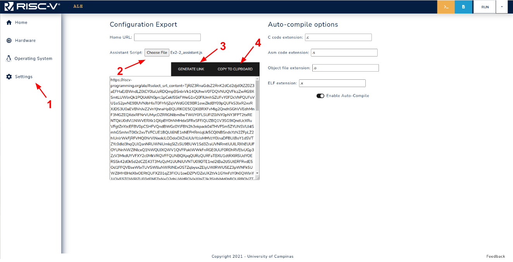
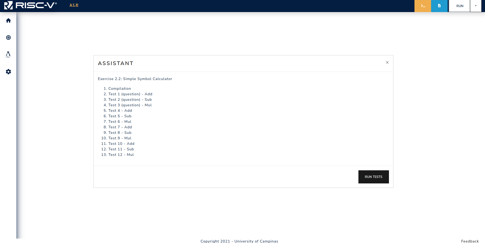

## Overview of How an Assistant Works

As explained in Chapter 1, the ALE simulator is a web-based simulator that is a mix of JavaScript code, WebAssembly artefacts and Unity Assets (for some peripherals). One of the classes that composes the simulator architecture is the Assistant Script component.
This component’s class can be extended to customize the assistant modal window, like adding buttons to perform certain actions, add functions that must be executed when the page is initially loaded, and also test cases that will be executed when the `RUN TESTS` button is clicked.

An example of an assistant script is shown below.

```javascript
// Import assistant and logging modules
import { UI_Helper, Assistant_Script } from "./modules/assistant.js";
import { LocalReport } from "./modules/connection.js";

class Ex2_2 extends Assistant_Script {
  constructor() {
    super();
    this.ui = new UI_Helper("Exercise 2.2: Simple Symbol Calculator");
    let report = new LocalReport();
    this.connections.push(report);

    // Enable syscalls and set the program stack
    this.predefined_args = [
      "--newlib",
      "--setreg",
      "sp=0x7FFFFFC",
      "--isa",
      "acdfimsu",
    ];

    this.ui.add_test(
      "Compilation",
      (_) => {
        report.restart();
        return this.generic_compile_test()();
      },
      { fail_early: true }
    );

    // Add fixed tests
    let test_id = 1;
    this.ui.add_test(
      `Test ${test_id++} (question) - Add`,
      this.simple_equality_test(`2 + 3\n`, `5\n`, {
        compare_function: (a, b) => a.trim() == b.trim(),
      })
    );
    this.ui.add_test(
      `Test ${test_id++} (question) - Sub`,
      this.simple_equality_test(`7 - 7\n`, `0\n`, {
        compare_function: (a, b) => a.trim() == b.trim(),
      })
    );
    this.ui.add_test(
      `Test ${test_id++} (question) - Mul`,
      this.simple_equality_test(`4 * 2\n`, `8\n`, {
        compare_function: (a, b) => a.trim() == b.trim(),
      })
    );

    for (let i = 0; i < 3; i++) {
      let a = this.randint(0, 9);
      let b = this.randint(0, 9 - a);
      this.ui.add_test(
        `Test ${test_id++} - Add`,
        this.simple_equality_test(`${a} + ${b}\n`, `${a + b}\n`, {
          compare_function: (a, b) => a.trim() == b.trim(),
        })
      );
      a = this.randint(0, 9);
      b = this.randint(0, a);
      this.ui.add_test(
        `Test ${test_id++} - Sub`,
        this.simple_equality_test(`${a} - ${b}\n`, `${a - b}\n`, {
          compare_function: (a, b) => a.trim() == b.trim(),
        })
      );
      a = this.randint(0, 3);
      b = this.randint(0, 3);
      this.ui.add_test(
        `Test ${test_id++} - Mul`,
        this.simple_equality_test(`${a} * ${b}\n`, `${a * b}\n`, {
          compare_function: (a, b) => a.trim() == b.trim(),
        })
      );
    }

    this.ui.final_result = (_) => {
      report.report["test_results"] = this.ui.test_results;
      let grade = 0;
      if (this.ui.test_results[0] != 0) {
        let n_tests = this.ui.test_results.length;
        for (let i = 1; i < n_tests; i++) {
          grade += this.ui.test_results[i];
        }
        grade = (grade * 10) / (n_tests - 1);
      }
      report.report["final_grade"] = grade;
      window.parent.postMessage({
        comment: this.ui.test_results,
        grade: grade,
        finish_test: true,
      });
      let blob = report.generate_report();
      return `Grade: ${grade}. Download your test report from Assistant execution report <a href=${window.URL.createObjectURL(
        blob
      )} download="ex2_2.report">(click here)</a>.`;
    };
  }

  randint(min, max) {
    return Math.floor(Math.random() * (max - min) + min);
  }
}

new Ex2_2();
```

In order to encode this assistant in an URL, the flow shown in Figure 5.1.1 needs to be followed.
First you need to go to the `Settings` tab (1), load the assistant file (2), and then generate the link (3).
The link can then be copied using the `COPY TO CLIPBOARD BUTTON` (4).

<div style="text-align:center">



<span class="caption">Figure 5.1.1: Assistant link generation workflow.</span>

</div>

When opening the link in a new tab, the assistant modal will have the test cases loaded, as shown in Figure 5.1.2.

<div style="text-align:center">



<span class="caption">Figure 5.1.2: Assistant modal when opening the embedded link.</span>

</div>

When generating such links, one additional thing that can be done is attaching active peripherals to the link. For instance, if the tests to be performed use a given peripheral device, they can be enabled prior to generating the link, in this way, when accessing the embedded link the peripheral will be already enabled.

The assistant scripts used in the exercise book are available <a target="_blank" href="https://github.com/discovery-unicamp/ale-exercise-assistants">here</a>.
